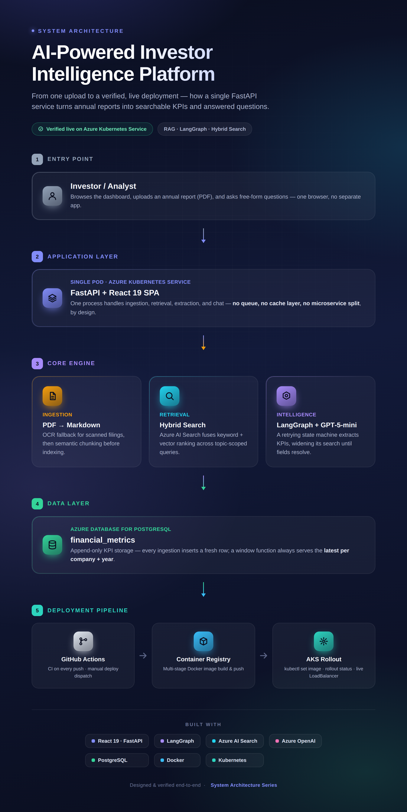

# AI-Powered Investor Intelligence Platform

[](https://github.com/AzaRKazar/AI-Powered-Investor-Intelligence-Platform/actions/workflows/ci.yml)

An AI-powered platform for uploading company annual reports (PDFs), extracting financial KPIs with an LLM, indexing content for semantic search, and answering questions via a RAG-based chatbot — with a live dashboard for browsing extracted metrics across companies.


**Status: Phase 1 complete, Phase 2 Tier 1 complete** — running end-to-end locally, containerized, and deployed live to Azure Kubernetes Service via a one-click CD workflow; KPI extraction now runs as a LangGraph state machine with confidence-based retries, the dashboard is now a React + TypeScript SPA, and CI (build/lint/test) runs on every push via GitHub Actions.

New to this repo? **[docs/getting-started.md](docs/getting-started.md)** ([PDF](pdf/Investor_Intelligence_Getting_Started.pdf)) is a beginner-friendly walkthrough — every cloud service explained (what it is, why it's needed, how to create it), local setup, testing, deployment, real troubleshooting, and links to learn each underlying technology. For the full system design — component diagrams, sequence flows, database/index schemas, API contracts, and the reasoning behind each major decision — see **[docs/architecture.md](docs/architecture.md)**. For the narrative version — the actual build order, real bugs hit and fixed, cost tradeoffs, and the story behind each decision — see **[docs/build-story.md](docs/build-story.md)**.

## What this does, in plain terms

You upload a PDF — a company's annual report (a "10-K," in US filing terminology). The system:

1. Turns the PDF into plain text.
2. Splits that text into small, meaningful chunks and turns each chunk into a list of numbers (an **embedding**) that captures its meaning.
3. Stores those chunks so they can be searched by *meaning*, not just keyword matching — this is **vector search**.
4. Asks an LLM (a large language model — think ChatGPT, but Azure's hosted version) to read the relevant chunks and pull out specific numbers: revenue, net income, and so on.
5. Saves those numbers to a database.
6. Lets you browse the results on a dashboard, and ask follow-up questions in a chat panel — the chat also searches the stored chunks for relevant context before answering, which is why this pattern is called **RAG** (Retrieval-Augmented Generation).

Everything below exists to make one of those six steps possible.

## How it works

1. **Ingest** — a PDF (10-K/10-Q) is converted to Markdown (`pymupdf4llm`), then split into semantically coherent chunks (LangChain's `SemanticChunker`) using real embeddings.
2. **Index** — each chunk is embedded (Azure OpenAI `text-embedding-ada-002`) and uploaded to Azure AI Search, which supports hybrid (keyword + vector) retrieval.
3. **Extract** — a LangGraph state machine (`retrieve → extract_kpi → validate → respond`) retrieves topic-targeted context (income statement, balance sheet, risk factors, growth drivers as separate queries) and asks Azure OpenAI (`gpt-5-mini`) to return structured KPIs as JSON. If validation finds fields still missing, it loops back with a wider search and a prompt focused on exactly what's missing, up to a retry limit, instead of silently returning an incomplete result.
4. **Store** — extracted KPIs land in Azure Database for PostgreSQL.
5. **Serve** — a FastAPI backend exposes upload/chat/metrics endpoints; a React SPA (built with Vite, served as static files by FastAPI) shows KPI cards, a company deep-dive (risk factors / growth drivers), and a live RAG chat panel.

## Screenshots

**Dashboard — KPI cards across all ingested companies**


**Architecture — From one upload to a verified, live deployment**



**Company deep-dive — AI-extracted risk factors and growth drivers (Microsoft)**


## Technology Stack

| Layer | Technology |
|---|---|
| Backend | FastAPI, Python 3.12 |
| LLM (chat + extraction) | Azure OpenAI — `gpt-5-mini` |
| Embeddings | Azure OpenAI — `text-embedding-ada-002` |
| Semantic search | Azure AI Search (hybrid keyword + vector) |
| Database | Azure Database for PostgreSQL (Flexible Server) |
| PDF → text | `pymupdf4llm` |
| Chunking | LangChain `SemanticChunker` |
| KPI extraction orchestration | LangGraph (state machine + confidence-based retry) |
| Frontend | React + TypeScript (Vite) |
| Containerization | Docker |
| Registry | Azure Container Registry (ACR) |
| Orchestration | Azure Kubernetes Service (AKS) |
| Package management | uv |

## Local Setup

### Prerequisites

| Tool | What it's for | Get it |
|---|---|---|
| **Python 3.12+** | Runs the backend | [python.org/downloads](https://www.python.org/downloads/) |
| **uv** | Fast Python package manager (this project doesn't use plain `pip`) | [docs.astral.sh/uv](https://docs.astral.sh/uv/) |
| **Node.js 20+** | Builds the React frontend | [nodejs.org](https://nodejs.org/) |
| **Docker** | Runs a local Postgres database, and builds the deployable image | [docs.docker.com/get-started](https://docs.docker.com/get-started/) |
| **Azure subscription** | Postgres, AI Search, and Azure OpenAI resources — see [Azure Resources](#azure-resources) below for exactly how to create each one | [portal.azure.com](https://portal.azure.com) |

Only needed if you're deploying, not for local dev: **Azure CLI** ([install guide](https://learn.microsoft.com/en-us/cli/azure/install-azure-cli)) and **kubectl** ([install guide](https://kubernetes.io/docs/tasks/tools/)).

### 1. Install backend dependencies

```bash
curl -LsSf https://astral.sh/uv/install.sh | sh
uv venv
source .venv/bin/activate
uv pip install -r requirements.txt
```

### 2. Install frontend dependencies

```bash
cd frontend
npm install
cd ..
```

### 3. Configure environment variables

```bash
cp .env.example .env
```

Fill in `.env` with your own Postgres, Azure AI Search, and Azure OpenAI credentials. See `.env.example` for every required key.

### 4. Start local Postgres (optional — for local dev without touching Azure Postgres)

```bash
docker compose up -d postgres
```

### 5. Run the app

**Frontend development** (hot reload, two processes):
```bash
# Terminal 1 - backend API
python app.py

# Terminal 2 - frontend dev server, proxies /api and /health to :8000
cd frontend && npm run dev
```
Visit **http://localhost:5173**.

**Backend-only / production-like** (one process, matches how Docker runs it):
```bash
cd frontend && npm run build && cd ..
python app.py
```
Visit **http://localhost:8000** — FastAPI serves the built React app directly.

## Running tests

```bash
uv pip install -r requirements-dev.txt
pytest -v
```

The suite covers the LangGraph KPI extraction pipeline (retry/validation logic, retrieval dedup) using real annual-report excerpts already committed under `data/markdown/`, with the LLM and retriever mocked — no live Azure credentials needed. This is the same command CI runs on every push/PR.

## Running with Docker

```bash
docker compose up -d
```

Builds the app image (a multi-stage build that compiles the React frontend, then copies the result into the Python runtime image — no manual `npm` steps needed) and runs it alongside a local Postgres container (see `docker-compose.yml`).

## Deploying to Azure

1. **Build and push to ACR**:
   ```bash
   docker build -t <your-acr-name>.azurecr.io/investor-intelligence-platform:latest .
   az acr login --name <your-acr-name>
   docker push <your-acr-name>.azurecr.io/investor-intelligence-platform:latest
   ```
2. **Create the Kubernetes secret** with your `.env` values (see `k8s/deployment.yaml` — it reads config via `envFrom.secretRef`):
   ```bash
   kubectl create secret generic investor-intel-secrets --from-literal=KEY=value ...
   ```
3. **Deploy**:
   ```bash
   kubectl apply -f k8s/deployment.yaml
   kubectl apply -f k8s/service.yaml
   kubectl get service investor-intel   # grab the external IP
   ```

## Continuous Deployment

`.github/workflows/deploy.yml` builds the image, pushes it to ACR, and rolls it out to AKS — but it's **manual-trigger only** (`workflow_dispatch`), not on every push, since AKS bills continuously while running and this project stops it between sessions rather than keeping it up 24/7.

To run it (from the Actions tab, or `gh workflow run deploy.yml`), the repo needs these GitHub Actions secrets first:

| Secret | Where to get it |
|---|---|
| `LOGIN_SERVER` | ACR resource → Overview → "Login server" (e.g. `<name>.azurecr.io`) |
| `USERNAME` / `PASSWORD` | ACR resource → Access keys (enable "Admin user") |
| `KUBE_CONFIG_B64` | `az aks get-credentials --resource-group investor-intelligence-rg --name <aks-name> --file - \| base64 -w0` |

Set them with `gh secret set <NAME>` or via the repo's Settings → Secrets and variables → Actions.

Two things the workflow does **not** set up for you, needed once per fresh ACR/AKS pair:
- **AKS needs pull access to ACR** — `az aks update --resource-group investor-intelligence-rg --name <aks-name> --attach-acr <acr-name>` (or the "Integrations" tab during AKS creation). Without this, pods sit in `ImagePullBackOff` with a 401 error even though the image pushed successfully.
- **The `investor-intel-secrets` Kubernetes secret** — holds the same values as `.env` (Postgres/Azure Search/Azure OpenAI credentials) so the pod can actually start; see step 2 of [Deploying to Azure](#deploying-to-azure) above.

**Status: verified live end-to-end** (2026-08-12) — `/health`, `/api/metrics` (real Postgres data), and the React frontend all confirmed serving through the LoadBalancer IP after a real `workflow_dispatch` run.

## Azure Resources

All resources live in a single dedicated resource group for easy teardown, created via the Azure Portal ([portal.azure.com](https://portal.azure.com) → **Create a resource** → search by name). Below is what each one is, why this project needs it, how to create it, what to grab for `.env`, and roughly what it costs — written for someone setting this up for the first time.

### Azure Database for PostgreSQL — Flexible Server

**What it is**: a managed relational (SQL) database. **Why this project uses it**: stores the final extracted KPI numbers — one row per company, per year. Structured data belongs in SQL, as opposed to the vector search database below, which is for *unstructured* text.

**How to create it**: Create a resource → **"Azure Database for PostgreSQL flexible servers"** → pick your resource group and region → Compute + storage: **Burstable**, smallest size (**B1ms**) → set an admin username and password → Networking: allow public access and add a firewall rule for your current IP (the Portal usually offers to do this automatically) → Review + create.

**What you'll need from it**: hostname (e.g. `yourserver.postgres.database.azure.com`), port (`5432`), admin username, admin password, and a database name you create (e.g. `investor_intelligence`).

**Cost**: Burstable tier, bills continuously while running (see Cost discipline below). Docs: [learn.microsoft.com/azure/postgresql/flexible-server](https://learn.microsoft.com/en-us/azure/postgresql/flexible-server/overview).

### Azure AI Search

**What it is**: a search engine supporting both keyword search and **vector search** (searching by meaning) — combining both is **hybrid search**. **Why this project uses it**: every PDF chunk gets stored here after ingestion; when the app needs context to answer a question, it asks this service for the most relevant chunks first, instead of re-reading the whole document.

**How to create it**: Create a resource → **"Azure AI Search"** → pick your resource group and region → Pricing tier: **Free (F0)** → Review + create. The search *index* (the schema) is created automatically by this project's own code (`vectorstore/create_index.py`) the first time the app starts — no manual index configuration needed.

**What you'll need from it**: endpoint URL (Overview page) and an admin API key (Settings → Keys).

**Cost**: Free (F0) tier, $0. Docs: [learn.microsoft.com/azure/search](https://learn.microsoft.com/en-us/azure/search/search-what-is-azure-search).

### Azure OpenAI

**What it is**: Microsoft's hosted version of OpenAI's models — same underlying GPT and embedding models as ChatGPT, running inside Azure's infrastructure. **Why this project uses it**: it's the actual "AI" — extracting structured KPIs from retrieved text, answering chat questions, and generating the embeddings the search index above relies on.

**The part beginners get stuck on**: Azure OpenAI access is **not automatically available** on every subscription. You typically need to request access and be approved, and depending on your subscription type (free trial vs. Pay-As-You-Go with billing enabled), you may need to upgrade your subscription before you can create a deployment. This is a real, known friction point — budget extra time for it.

**How to create it**: Create a resource → **"Azure OpenAI"** → pick your resource group and region (`East US` reliably has model availability) → once created, open **Azure AI Foundry** (linked from the resource's Overview page) and deploy two models: a chat model (this project uses `gpt-5-mini`) and an embedding model (`text-embedding-ada-002`) — name each deployment, you'll reference it by that name → grab endpoint + key from **Keys and Endpoint**.

**What you'll need from it**: endpoint, API key, API version (a date string, e.g. `2024-10-21`), and your two deployment names.

**Cost**: pay-per-use, billed per token processed — real-world cost at this project's scale (a handful of documents) has been well under a dollar total. Docs: [learn.microsoft.com/azure/ai-services/openai](https://learn.microsoft.com/en-us/azure/ai-services/openai/overview).

### Azure Document Intelligence *(optional)*

**What it is**: an OCR service — it reads text out of images, including scanned documents. **Why this project uses it**: some PDFs have no real text layer at all (a scanned or print-flattened document is really just a picture of a page). Ingestion detects that case and falls back to this service to recover the text via OCR, instead of silently returning empty KPIs — see [Known Limitations](#known-limitations) for the real Apple 10-K this was built and verified against.

**Do you need it?** Only if you plan to upload a scanned PDF — the app runs completely fine without it otherwise.

**How to create it**: Create a resource → **"Document Intelligence"** → Pricing tier: **Free (F0)** covers light use (500 pages/month); switch to **Standard (S0)** if you hit a file-size limit on a large scanned PDF (a real example of this happening is in the Continuous Deployment section's history) → grab endpoint + key from **Keys and Endpoint**.

**Cost**: Free tier covers light use; Standard is ~$1.50 per 1,000 pages. Docs: [learn.microsoft.com/azure/ai-services/document-intelligence](https://learn.microsoft.com/en-us/azure/ai-services/document-intelligence/overview).

### Azure Container Registry (ACR) *(only needed to deploy)*

**What it is**: private storage for Docker container images — like Docker Hub, but private and inside your own Azure account. **Why this project uses it**: Kubernetes needs to pull the built container image from somewhere to run it.

**How to create it**: Create a resource → **"Container Registry"** → pick **Basic** tier → enable **Admin user** (Settings → Access keys) for simple username/password push access.

**Cost**: Basic tier, storage + minimal per-use — no need to stop between sessions. Docs: [learn.microsoft.com/azure/container-registry](https://learn.microsoft.com/en-us/azure/container-registry/container-registry-intro).

### Azure Kubernetes Service (AKS) *(only needed to deploy)*

**What it is**: a managed Kubernetes cluster — Kubernetes runs containers reliably at scale (restarting them if they crash, load-balancing traffic). **Why this project uses it**: it's how the app is actually hosted live and publicly reachable, rather than just running on a laptop.

**How to create it**: Create a resource → **"Kubernetes Service"** → single small node (this project uses `Standard_D2as_v7`) → on the **Integrations** tab, attach the ACR above so the cluster can pull images without extra configuration later. Full deploy steps are in [Deploying to Azure](#deploying-to-azure) above.

**Cost**: bills continuously while running, unlike everything else above (see Cost discipline below). Docs: [learn.microsoft.com/azure/aks](https://learn.microsoft.com/en-us/azure/aks/what-is-aks).

### Cost discipline

A Cost Management budget alert is set on the resource group. Postgres is stopped between work sessions (bills continuously while running, unlike AI Search's free tier and Azure OpenAI's pure pay-per-use pricing).

**AKS gotcha, confirmed the hard way**: `az aks stop` only deallocates node compute — it does *not* stop the Standard Load Balancer or the Standard static Public IP(s) AKS provisions in its auto-created `MC_*` node resource group, and both keep billing hourly regardless of cluster power state. Because of this, AKS gets **deleted** between work sessions instead of just stopped, and recreated when actually needed (see [Deploying to Azure](#deploying-to-azure) and [Continuous Deployment](#continuous-deployment) — both are already written to be repeatable from scratch).

## Troubleshooting

Real issues hit during this project's development, not a generic checklist:

* **"Rate limit exceeded" during PDF ingestion.** `SemanticChunker` embeds nearly every sentence individually, which can exceed a freshly-created Azure OpenAI deployment's low default rate limit. Already handled in the code (`chunk_size=16`, `max_retries=10` on the embeddings client) — if you still hit this, your deployment's quota may need raising in Azure AI Foundry.
* **KPI fields come back `null` for a PDF you just uploaded.** Two possible causes: (a) the model genuinely couldn't find that field after 3 attempts — check the logs for `Extraction incomplete for X - still missing: ...`, which means the pipeline tried honestly and gave up, not a bug; or (b) the PDF is scanned/image-only with no text layer — see Azure Document Intelligence above.
* **Postgres connection times out.** Almost always a firewall rule — Azure Postgres only accepts connections from IP addresses you've explicitly allowed. If your IP changes (common on a laptop switching networks), add a new firewall rule for the current IP in the Portal.
* **AKS pods stuck in `ImagePullBackOff`.** The cluster lacks permission to pull from your registry. Fix: `az aks update --resource-group <rg> --name <cluster> --attach-acr <registry-name>`.
* **A freshly-deployed pod won't start at all.** Check whether the `investor-intel-secrets` Kubernetes Secret exists (`kubectl get secret investor-intel-secrets`) — it isn't created automatically by the deploy workflow.
* **You stopped AKS but you're still being billed.** See the AKS gotcha above — `delete` the cluster, not just `stop` it, once you're done for a while.

## Known Limitations

* **Table-formatted financial data can be lost during chunking.** `SemanticChunker` splits on prose sentence boundaries; some companies present certain figures (e.g. total liabilities) as Markdown tables rather than sentences, which can fail to embed cleanly. Confirmed on a real Tesla 10-K: most fields (revenue, net income, cash flow, risk factors, growth drivers) extracted correctly, but two table-only figures did not. A proper fix would need table-aware chunking at the ingestion layer.
* **PDF quality varies — fixed via OCR fallback.** A scanned/image-only PDF has no extractable text layer for `pymupdf4llm` to read, which used to mean empty KPIs — found on a real Apple 10-K, confirmed via `pymupdf` as 79 pages with 0 extractable characters. Ingestion now checks total extractable characters before conversion and, if there's effectively none, falls back to OCR via Azure Document Intelligence's `prebuilt-read` model. Verified end-to-end on that same Apple PDF: recovered 219,089 characters of real text, then extracted and saved real KPIs (revenue, net income, risk factors, growth drivers) — no code left in a "should work" state, this actually ran. Needs `AZURE_DOCUMENT_INTELLIGENCE_ENDPOINT`/`API_KEY` set (see [Azure Resources](#azure-resources)); without them, a scanned PDF still produces empty KPIs, now with a clear error in the logs instead of a silent null result.

## Roadmap (Phase 2)

**Done — Phase 2 Tier 1 complete:** LangGraph state-machine refactor of the RAG + KPI extraction flow (confidence-based retry loop), a React + TypeScript frontend (Vite) replacing the server-rendered dashboard, CI via GitHub Actions (frontend lint/build, backend import check + pytest suite, Docker build — on every push/PR to `master`), a pytest regression suite for the extraction pipeline (see [Running tests](#running-tests)), and a manual-trigger CD workflow to AKS (see [Continuous Deployment](#continuous-deployment) — verified live end-to-end).

**Planned (Tier 2, time permitting):** a NoSQL split for unstructured data and a lightweight risk-scoring model on stored KPIs.

## Further Learning Resources

If a piece of this project is unfamiliar and you want to understand it, not just run it:

| Topic | Where to start |
|---|---|
| FastAPI (the backend framework) | [fastapi.tiangolo.com](https://fastapi.tiangolo.com/) — their own tutorial is excellent and hands-on |
| React | [react.dev/learn](https://react.dev/learn) |
| TypeScript | [typescriptlang.org/docs](https://www.typescriptlang.org/docs/) |
| LangGraph (the state-machine orchestration library) | [langchain-ai.github.io/langgraph](https://langchain-ai.github.io/langgraph/) |
| RAG (Retrieval-Augmented Generation) as a concept | [learn.microsoft.com/azure/search/retrieval-augmented-generation-overview](https://learn.microsoft.com/en-us/azure/search/retrieval-augmented-generation-overview) |
| SQL / PostgreSQL | [postgresql.org/docs](https://www.postgresql.org/docs/) |
| Docker | [docs.docker.com](https://docs.docker.com/) |
| Kubernetes | [kubernetes.io/docs/concepts](https://kubernetes.io/docs/concepts/) |
| GitHub Actions (CI/CD) | [docs.github.com/actions](https://docs.github.com/en/actions) |
| pytest | [docs.pytest.org](https://docs.pytest.org/) |

## Notes

* Store secrets in `.env` and never commit it to source control (`.env.example` is the tracked template).
* Verify PostgreSQL firewall rules allow access from wherever the app is actually running before debugging a "connection timeout" as anything more exotic.
