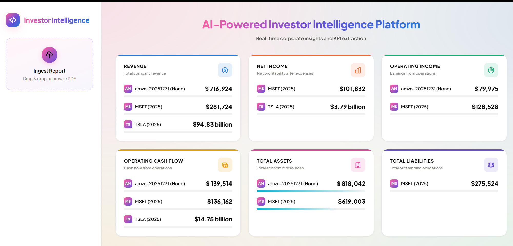
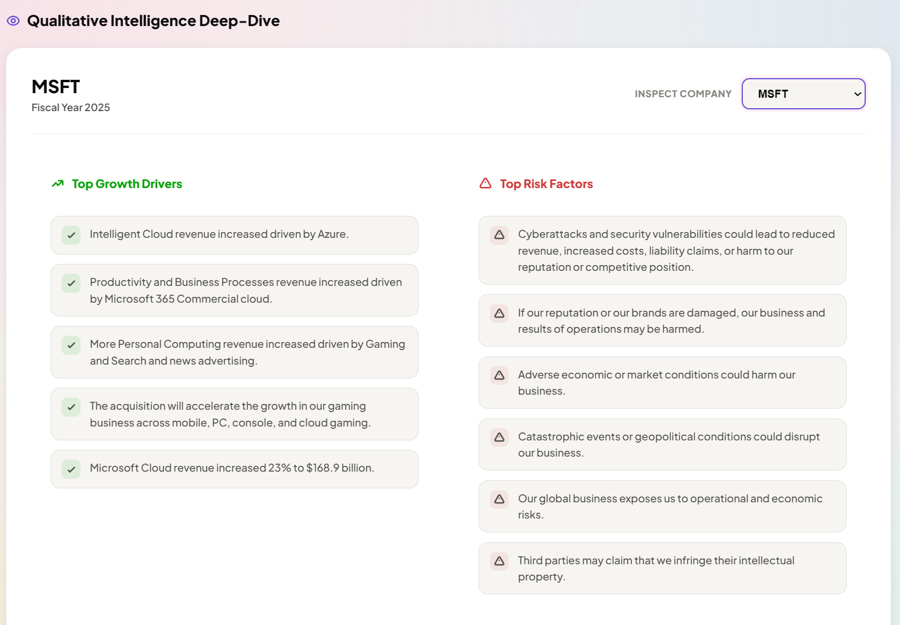
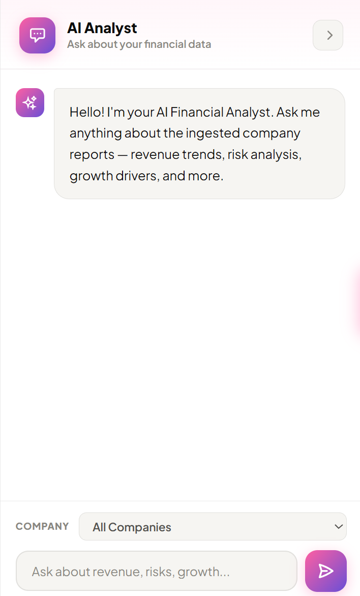

# AI-Powered Investor Intelligence Platform

An AI-powered platform for uploading company annual reports (PDFs), extracting financial KPIs with an LLM, indexing content for semantic search, and answering questions via a RAG-based chatbot — with a live dashboard for browsing extracted metrics across companies.


**Status: Phase 1 complete, Phase 2 in progress** — running end-to-end locally, containerized, and deployed live to Azure Kubernetes Service; the dashboard is now a React + TypeScript SPA.

## How it works

1. **Ingest** — a PDF (10-K/10-Q) is converted to Markdown (`pymupdf4llm`), then split into semantically coherent chunks (LangChain's `SemanticChunker`) using real embeddings.
2. **Index** — each chunk is embedded (Azure OpenAI `text-embedding-ada-002`) and uploaded to Azure AI Search, which supports hybrid (keyword + vector) retrieval.
3. **Extract** — a RAG pipeline retrieves topic-targeted context (income statement, balance sheet, risk factors, growth drivers as separate queries) and asks Azure OpenAI (`gpt-5-mini`) to return structured KPIs as JSON.
4. **Store** — extracted KPIs land in Azure Database for PostgreSQL.
5. **Serve** — a FastAPI backend exposes upload/chat/metrics endpoints; a React SPA (built with Vite, served as static files by FastAPI) shows KPI cards, a company deep-dive (risk factors / growth drivers), and a live RAG chat panel.

## Screenshots

**Dashboard — KPI cards across all ingested companies**



**Company deep-dive — AI-extracted risk factors and growth drivers (Microsoft)**



**RAG chatbot — ask questions grounded in the ingested reports**



## Technology Stack

| Layer | Technology |
|---|---|
| Backend | FastAPI, Python 3.12 |
| LLM (chat + extraction) | Azure OpenAI — `gpt-5-mini` |
| Embeddings | Azure OpenAI — `text-embedding-ada-002` |
| Semantic search | Azure AI Search (hybrid keyword + vector) |
| Database | Azure Database for PostgreSQL (Flexible Server) |
| PDF → text | `pymupdf4llm` |
| Chunking | LangChain `SemanticChunker` |
| Frontend | React + TypeScript (Vite) |
| Containerization | Docker |
| Registry | Azure Container Registry (ACR) |
| Orchestration | Azure Kubernetes Service (AKS) |
| Package management | uv |

## Local Setup

### Prerequisites

* Python 3.12+
* [uv](https://astral.sh/uv) package manager
* Node.js 20+ (for the frontend)
* Docker (for local Postgres via Docker Compose)
* An Azure subscription with Postgres, AI Search, and Azure OpenAI resources provisioned (see [Azure Resources](#azure-resources) below)

### 1. Install backend dependencies

```bash
curl -LsSf https://astral.sh/uv/install.sh | sh
uv venv
source .venv/bin/activate
uv pip install -r requirements.txt
```

### 2. Install frontend dependencies

```bash
cd frontend
npm install
cd ..
```

### 3. Configure environment variables

```bash
cp .env.example .env
```

Fill in `.env` with your own Postgres, Azure AI Search, and Azure OpenAI credentials. See `.env.example` for every required key.

### 4. Start local Postgres (optional — for local dev without touching Azure Postgres)

```bash
docker compose up -d postgres
```

### 5. Run the app

**Frontend development** (hot reload, two processes):
```bash
# Terminal 1 - backend API
python app.py

# Terminal 2 - frontend dev server, proxies /api and /health to :8000
cd frontend && npm run dev
```
Visit **http://localhost:5173**.

**Backend-only / production-like** (one process, matches how Docker runs it):
```bash
cd frontend && npm run build && cd ..
python app.py
```
Visit **http://localhost:8000** — FastAPI serves the built React app directly.

## Running with Docker

```bash
docker compose up -d
```

Builds the app image (a multi-stage build that compiles the React frontend, then copies the result into the Python runtime image — no manual `npm` steps needed) and runs it alongside a local Postgres container (see `docker-compose.yml`).

## Deploying to Azure

1. **Build and push to ACR**:
   ```bash
   docker build -t <your-acr-name>.azurecr.io/investor-intelligence-platform:latest .
   az acr login --name <your-acr-name>
   docker push <your-acr-name>.azurecr.io/investor-intelligence-platform:latest
   ```
2. **Create the Kubernetes secret** with your `.env` values (see `k8s/deployment.yaml` — it reads config via `envFrom.secretRef`):
   ```bash
   kubectl create secret generic investor-intel-secrets --from-literal=KEY=value ...
   ```
3. **Deploy**:
   ```bash
   kubectl apply -f k8s/deployment.yaml
   kubectl apply -f k8s/service.yaml
   kubectl get service investor-intel   # grab the external IP
   ```

## Azure Resources

All resources live in a single dedicated resource group for easy teardown. Provisioned manually via the Azure Portal:

* **Azure Database for PostgreSQL Flexible Server** — Burstable tier, smallest SKU
* **Azure AI Search** — Free (F0) tier
* **Azure OpenAI** — `gpt-5-mini` (chat) + `text-embedding-ada-002` (embeddings) deployments
* **Azure Container Registry** — Basic tier
* **Azure Kubernetes Service** — single-node cluster, smallest viable x86 VM size available in-region

**Cost discipline**: a Cost Management budget alert is set on the resource group; Postgres and AKS are stopped between work sessions (both bill continuously while running, unlike AI Search's free tier and Azure OpenAI's pure pay-per-use pricing).

## Known Limitations

* **Table-formatted financial data can be lost during chunking.** `SemanticChunker` splits on prose sentence boundaries; some companies present certain figures (e.g. total liabilities) as Markdown tables rather than sentences, which can fail to embed cleanly. Confirmed on a real Tesla 10-K: most fields (revenue, net income, cash flow, risk factors, growth drivers) extracted correctly, but two table-only figures did not. A proper fix would need table-aware chunking at the ingestion layer.
* **PDF quality varies.** A scanned/image-only PDF (no extractable text layer) will produce empty KPIs — this is a fundamental limit of text extraction, not a bug in the pipeline.

## Roadmap (Phase 2)

**Done:** React + TypeScript frontend (Vite), replacing the server-rendered dashboard.

**Planned:** LangChain/LangGraph orchestration for the RAG + KPI flow, CI/CD via GitHub Actions, and (time permitting) a NoSQL split for unstructured data and a lightweight risk-scoring model on stored KPIs.

## Notes

* Store secrets in `.env` and never commit it to source control (`.env.example` is the tracked template).
* Verify PostgreSQL firewall rules allow access from wherever the app is actually running before debugging a "connection timeout" as anything more exotic.
