# System Architecture

**AI-Powered Investor Intelligence Platform** — ingests company annual reports (PDF), extracts financial KPIs via a retrying LLM pipeline, indexes content for semantic search, and answers questions through a RAG chatbot. This document covers the system end to end: high-level component and data-flow design, then low-level schemas, state machines, and API contracts, grounded in the actual code and verified live on Azure Kubernetes Service.

---

## 1. System Context

One FastAPI service serves a React SPA and a JSON API, backed by four managed Azure services. There is no queue, no cache layer, and no microservice split — a single process handles ingestion, retrieval, extraction, and chat, which is a deliberate scope decision covered in [§4](#4-key-design-decisions).

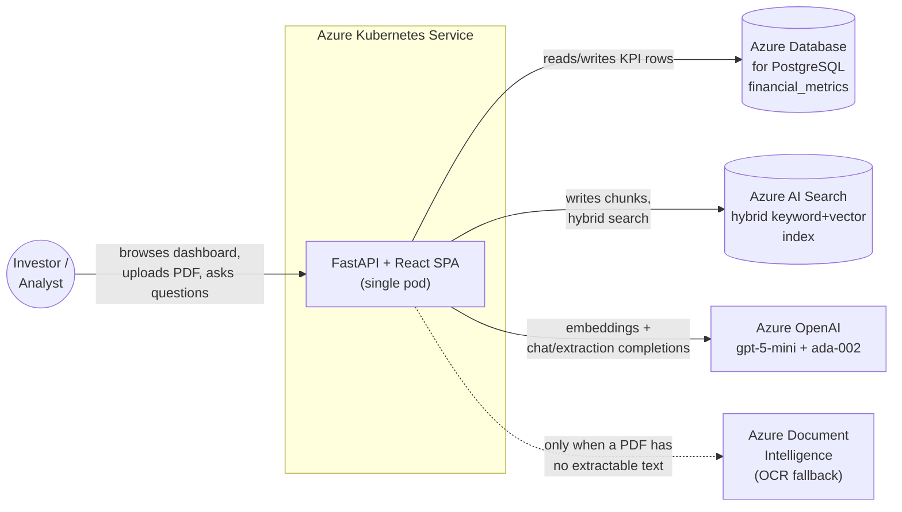

---

## 2. High-Level Design

### 2.1 Component architecture

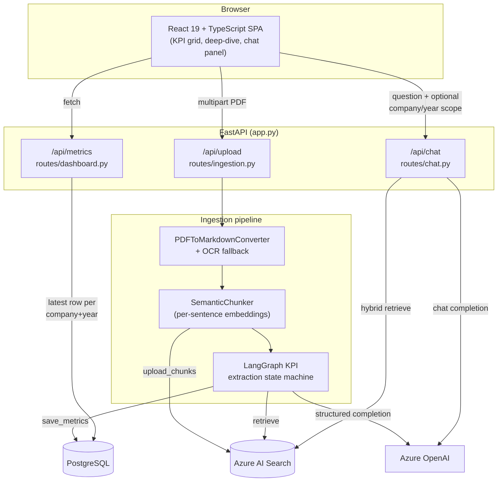

### 2.2 Ingestion sequence — from PDF to stored KPIs

The full pipeline runs **synchronously inside the HTTP request** — the client's `POST /api/upload` doesn't return until every step below completes (typically 2–4 minutes for a 100-page 10-K). This is a scope tradeoff, not an oversight ([§4](#4-key-design-decisions)).

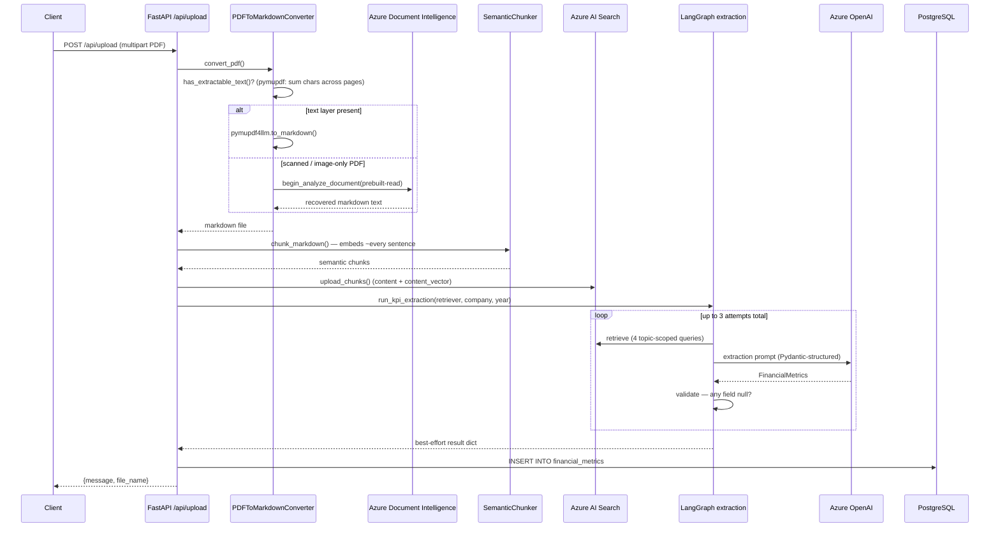

### 2.3 Chat sequence — RAG question answering

Simpler and stateless: one retrieval pass, one completion, no retry loop. `company`/`year` scoping is optional and independent of the dashboard's own company selector — the two were never wired together.

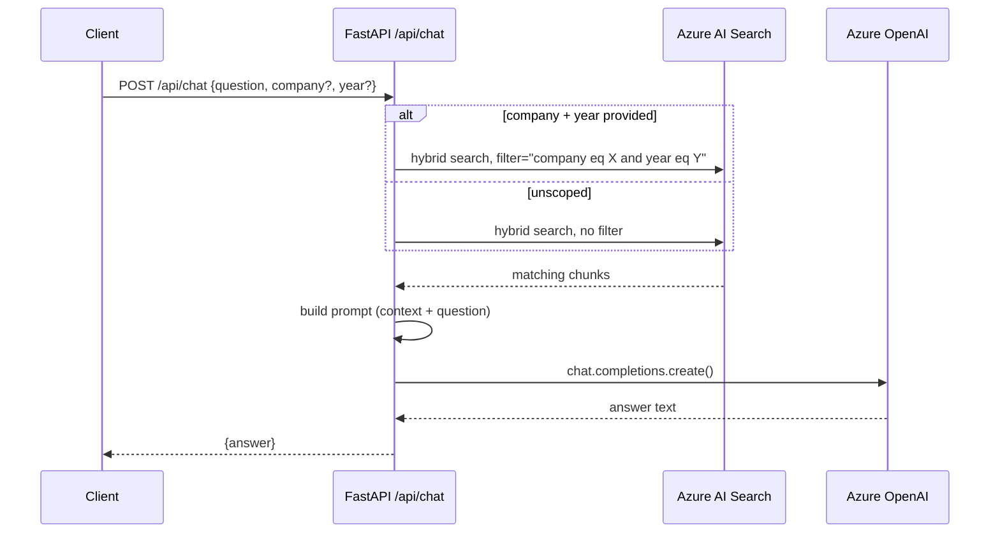

### 2.4 Deployment architecture

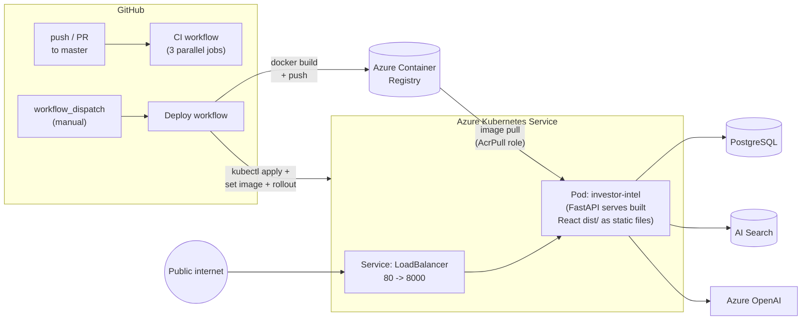

### 2.5 Technology choices

| Layer | Technology | Why this, specifically |
|---|---|---|
| Frontend | React 19 + TypeScript, Vite | Faithful SPA port of an existing vibrant/colorful dashboard design — no framework needed beyond component structure; no router (single view), no Redux/React Query (scope doesn't warrant it) |
| Backend | FastAPI, Python 3.12 | Async-capable, typed request models via Pydantic, matches the reference architecture this project extended |
| Orchestration | LangGraph | Confidence-based retry loop needs actual state (retry count, missing fields) carried between attempts — a linear function chain can't express "loop back and re-retrieve with a wider net" |
| LLM | Azure OpenAI `gpt-5-mini` | Structured output support (`beta.chat.completions.parse` with a Pydantic model), with a JSON-regex fallback for deployments that don't support it |
| Embeddings | Azure OpenAI `text-embedding-ada-002` | 1536-dim, matches the AI Search index's vector field exactly |
| Search | Azure AI Search, hybrid (keyword + HNSW vector) | Pure keyword search surfaced unrelated footnotes over the actual concise figure a query was looking for; pure vector alone underperformed on exact terms like "Total liabilities" |
| Database | Azure PostgreSQL Flexible Server, raw SQL via SQLAlchemy `text()` | No ORM — matches the flat, script-style module structure of the reference codebase this project extends |
| OCR fallback | Azure Document Intelligence, `prebuilt-read` only | GPT-5-mini already does structured field extraction downstream; `Layout` or `Custom extraction` tiers (7–20x the per-page cost) would be redundant |
| Containers | Docker multi-stage (`node:24-slim` → `python:3.12-slim`) | One image, frontend built fresh every time, no stale `dist/` leaking into the build context |
| CI | GitHub Actions, 3 parallel jobs | Frontend lint/build, backend import+compile+pytest, Docker build — every push/PR, no live Azure credentials needed |
| CD | GitHub Actions, `workflow_dispatch` only | AKS bills continuously while running; this project stops it between sessions, so auto-deploy-on-push would either fail against a stopped cluster or silently need someone to remember to start it first |

---

## 3. Low-Level Design

### 3.1 LangGraph KPI extraction state machine

`rag/kpi_extraction_graph.py`. Four nodes, one conditional edge, a `retry_count` that doubles as both the loop counter and the signal for how wide the next retrieval should search.

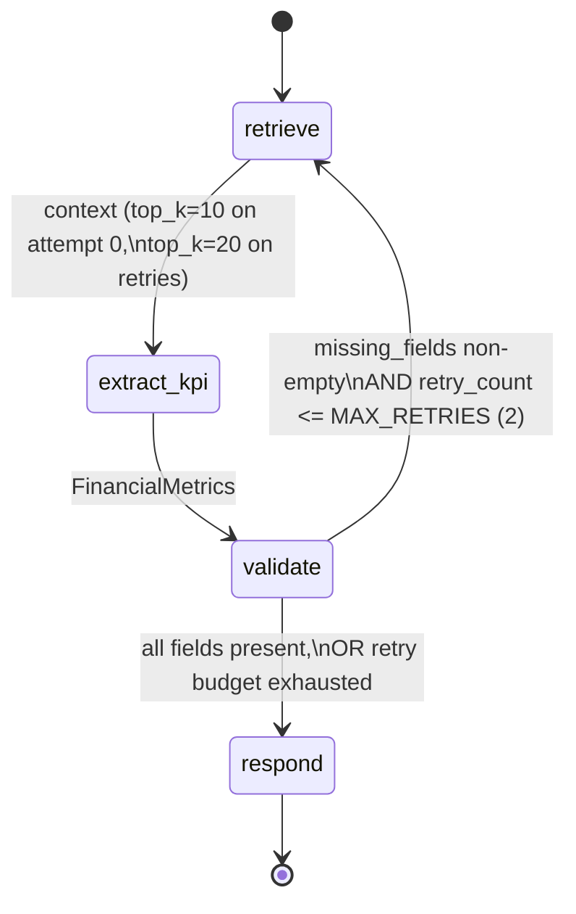

**Retry semantics, precisely** (this exact boundary was a real off-by-one bug, caught and fixed before this document was written):

- `retrieve_node` increments `retry_count` *after* retrieving, so `retry_count` reads as "attempts already made."
- `should_retry` uses `retry_count <= MAX_RETRIES`, not `<`. With `MAX_RETRIES = 2`, that permits retries at `retry_count` 0, 1, and 2 — **3 total extraction attempts**, not 2. `should_retry(retry_count=3)` is the first state that returns `"done"`.
- A retry doesn't just re-ask the same question: `build_focused_prompt()` appends the specific missing field names to the prompt, and `retrieve_node` widens `top_k` from 10 to `RETRY_TOP_K=20` — a retry is strictly a better-informed second attempt, not a blind repeat.
- If retries are exhausted with fields still missing, `respond_node` still returns the best-effort result (never raises) — a partially-filled KPI row beats no row, and `missing_fields` is logged so the gap is visible rather than silent.

This exact boundary is locked in as a regression test (`tests/test_kpi_extraction_graph.py::test_should_retry_boundary`), parametrized across `retry_count` 0 through `MAX_RETRIES + 1`.

### 3.2 Database schema

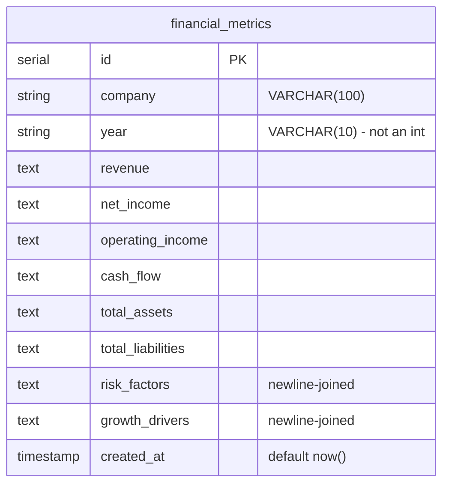

**Append-only, not upsert.** Every ingestion — including a re-run of the same PDF — inserts a brand-new row rather than updating in place. `GET /api/metrics` reads through a window function that keeps only the newest row per `(company, year)`:

```sql
SELECT * FROM (
    SELECT *, ROW_NUMBER() OVER (
        PARTITION BY company, year ORDER BY created_at DESC
    ) AS rn
    FROM financial_metrics
) t WHERE rn = 1
```

This trades storage (old rows never get cleaned up) for simplicity: ingestion never needs to decide *whether* a row already exists, only *insert*. Re-ingesting Apple's PDF after fixing the OCR fallback didn't require deleting the two prior all-`NULL` rows — the new row simply became the one `rn = 1` picks.

`year` is `VARCHAR(10)`, not an integer — the frontend's `MetricRow` type has to treat it as a string, which bit the original Jinja→React port until it was typed correctly.

### 3.3 Search index & hybrid retrieval

Azure AI Search index (`vectorstore/create_index.py`): `id` (key), `company`/`year`/`source_file` (filterable strings), `content` (searchable text), `content_vector` (1536-dim float collection, HNSW algorithm).

`Retriever.invoke()` runs **both** a keyword search (`search_text`) and a vector search (`VectorizedQuery` against `content_vector`) in the same request — Azure AI Search fuses the two rankings server-side. `retrieve_context()` (used only during KPI extraction, not chat) doesn't issue one broad query — it runs **four separate topic-scoped queries** (income statement, balance sheet, risk factors, growth drivers) and deduplicates the results by `page_content`:

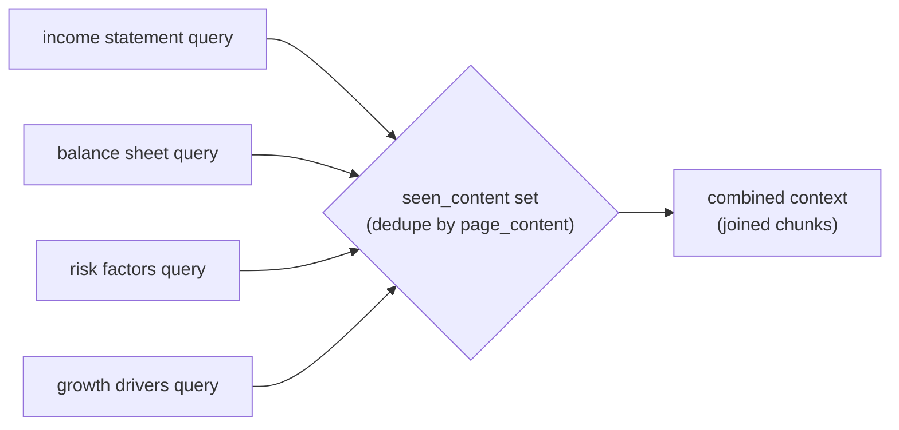

One broad query was tried first and dropped — under a single top-k budget, the four topics compete for the same ranking slots, and risk/growth content routinely lost out to financial figures. Splitting the queries gives each topic its own shot regardless of how the others rank.

### 3.4 OCR fallback decision logic

`ingestion/pdf_to_markdown.py`. The fallback only fires when the primary path genuinely has nothing to work with — verified on Apple's actual 10-K, a 79-page scanned filing that produced 0 extractable characters.

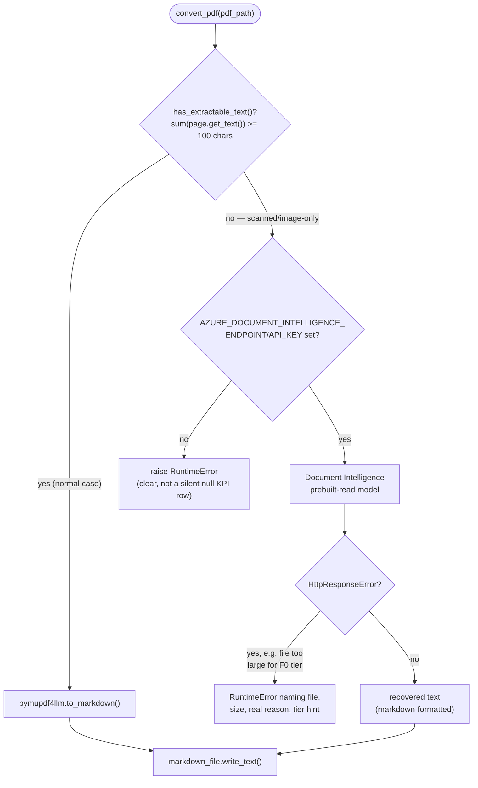

Scoped deliberately to the **Read** model (`$1.50/1,000 pages` after 500 free/month) rather than `Layout` or `Custom extraction` (`$10–30/1,000 pages`): the downstream LangGraph pipeline already does structured field extraction with an LLM, so paying for Document Intelligence's own field/table extraction would be redundant spend for zero benefit here.

### 3.5 API contracts

| Method & path | Request | Response (success) | Response (error) |
|---|---|---|---|
| `GET /health` | — | `{"status": "healthy"}` | — |
| `GET /api/metrics` | — | `MetricRow[]` (latest row per company/year) | — |
| `POST /api/upload` | multipart `FormData`, field `file` (PDF) | `{message, file_name}` — **after** the full pipeline completes | Plain-text 500 (no try/except in the route) — client must parse defensively |
| `POST /api/chat` | JSON `{question, company?, year?}` — `company`/`year` must be **omitted**, not `null`, when unscoped | `{answer}` | `{detail}`, HTTP 500 |

`MetricRow.year` is a string. Numeric-looking fields (`revenue`, `total_assets`, ...) are pre-formatted strings like `"$ 416,161"`, not numbers — they're stored and returned exactly as the LLM extracted them.

### 3.6 Frontend component ownership

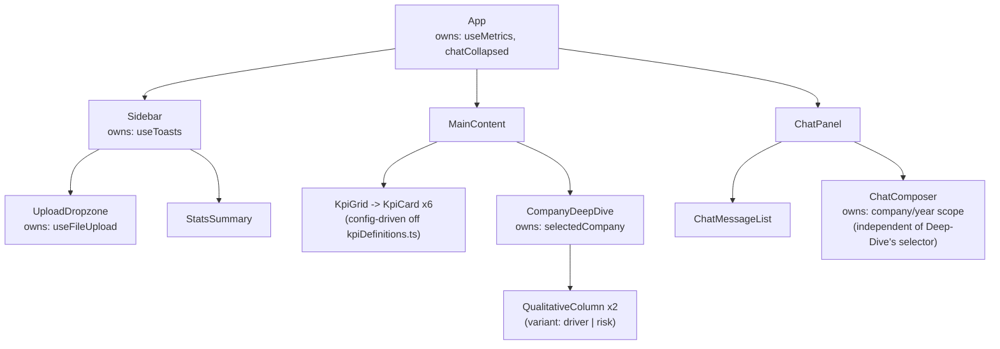

`chatCollapsed` lives in `App`, not `ChatPanel`, because three separate DOM siblings need it (the grid wrapper's class, `ChatPanel`'s own class, and a floating collapsed-tab that lives outside the grid entirely). Each `KpiCard` sets its accent via an inline CSS custom property (`--kpi-accent`) rather than a `:nth-child` position rule — this was also a real bug fix during the React port: the original hand-rolled JS referenced `--accent-blue`/`--accent-red` custom properties that were never actually defined anywhere in the stylesheet.

### 3.7 CI/CD pipeline

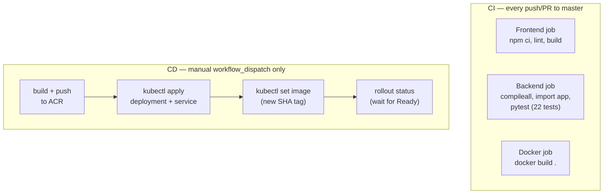

Two one-time setup steps the CD workflow does **not** perform itself, both real gaps hit while standing this up:

1. **AKS needs explicit pull permission on ACR** (`az aks update --attach-acr`) — skipping this during cluster creation produces `ImagePullBackOff` with a 401, even though the push to ACR itself succeeds.
2. **The `investor-intel-secrets` Kubernetes Secret** doesn't exist on a fresh cluster and isn't created by the workflow — it's populated once from `.env` via `kubectl create secret generic --from-literal=...`.

---

## 4. Key design decisions

| Decision | Alternative considered | Why this won |
|---|---|---|
| LangGraph state machine for extraction | Linear function chain (retrieve → prompt → parse) | Needed actual loop state (retry count, which fields are still missing) carried between attempts — a chain can call functions in sequence but can't express "go back and try again, differently" |
| Synchronous upload (blocks the HTTP request) | Background job + polling/websocket for progress | Correct engineering answer for production; disproportionate for this project's scale. The frontend's progress bar is honest about this — it shows a real 0–45% for the actual upload, then a cosmetic 75–95% ramp for the (already-started) server-side processing |
| Hybrid search (keyword + vector) | Pure vector search | Keyword-only surfaced unrelated footnotes; vector-only occasionally missed exact terms like "Total liabilities" that a keyword match catches directly |
| Raw SQL via SQLAlchemy `text()`, no ORM | SQLAlchemy ORM models | Matches the flat, script-style module structure of the reference architecture this project extends — one table, no relationships, an ORM would add indirection without benefit |
| Append-only `financial_metrics` rows | `UPSERT` on `(company, year)` | Ingestion never needs to check "does this row exist" — it just inserts, and the dashboard's window-function query always resolves to the newest row. Re-running ingestion after a bug fix (exactly what happened with Apple) just works, no manual cleanup |
| OCR fallback scoped to `prebuilt-read` only | Document Intelligence `Layout` or `Custom extraction` models | GPT-5-mini already performs structured field extraction downstream — paying 7–20x more per page for Document Intelligence's own field/table extraction would be pure redundancy |
| CD as manual `workflow_dispatch` | Auto-deploy on every push to `master` | AKS bills continuously while running and is deliberately stopped between work sessions; an auto-deploy pipeline would either fail against a stopped cluster or require remembering to start it first, defeating the point of stopping it |

---

## 5. Known limitations

Two are load-bearing enough to affect how results should be read, not just edge cases:

- **Markdown-table financial data can still be lost during chunking.** `SemanticChunker` splits on prose sentence boundaries; a company that presents a figure (e.g. total liabilities) as a Markdown table rather than a sentence can fail to embed cleanly. Confirmed on a real Tesla 10-K — most fields extracted correctly, two table-only figures did not. Table-aware chunking at the ingestion layer would fix this; not yet built.
- **A scanned PDF with no Document Intelligence credentials configured still produces empty KPIs** — the OCR fallback ([§3.4](#34-ocr-fallback-decision-logic)) only helps when those two env vars are set.

Full detail and current status: [README § Known Limitations](../README.md#known-limitations).

---

## 6. Verified, not just designed

Every flow in this document has been exercised against real Azure services, not just described:

- **Ingestion**: a real scanned Apple 10-K (79 pages, 0 extractable characters) went through the OCR fallback, recovered 219,089 real characters, and produced genuine extracted KPIs (revenue, net income, 6 risk factors, 5 growth drivers) — all saved to Postgres and visible on the live dashboard.
- **CD**: a real `workflow_dispatch` run built the image, pushed to ACR, and rolled it out to AKS; `/health`, `/api/metrics`, and the React frontend were all confirmed serving through the LoadBalancer IP afterward.
- **Regression suite**: 22 pytest tests cover the retry/validation state machine (including the exact off-by-one boundary from [§3.1](#31-langgraph-kpi-extraction-state-machine)), retrieval dedup, PDF text-detection, and OCR error-wrapping — grounded in real annual-report excerpts already committed to the repo, with the LLM/retriever/Document Intelligence mocked so the suite needs no live credentials to run in CI.
